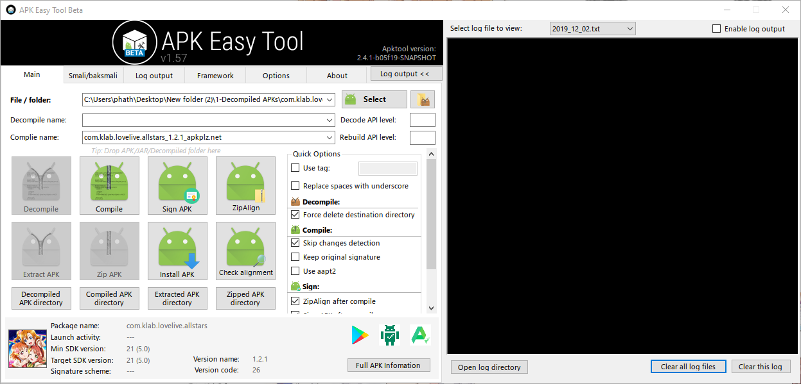
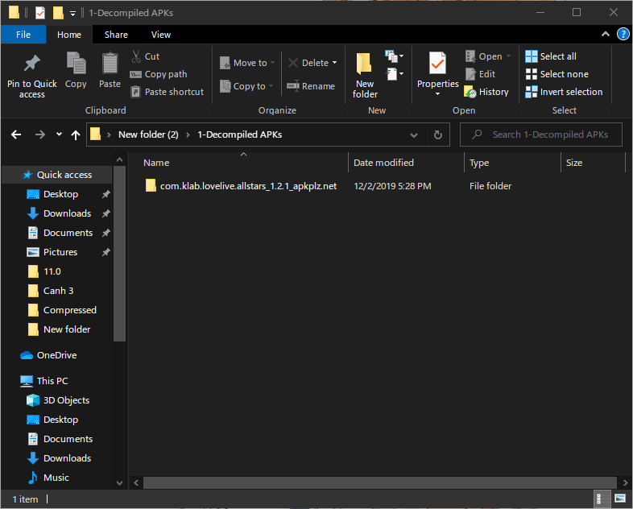
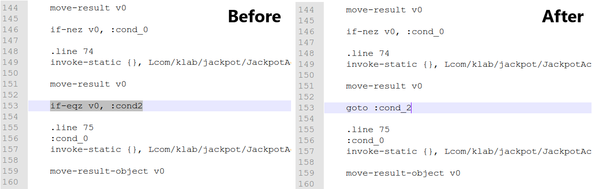
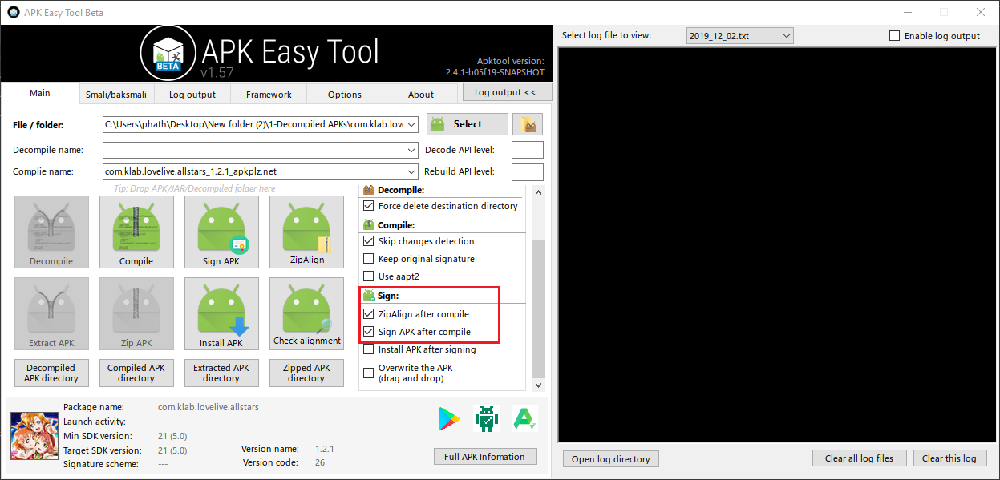
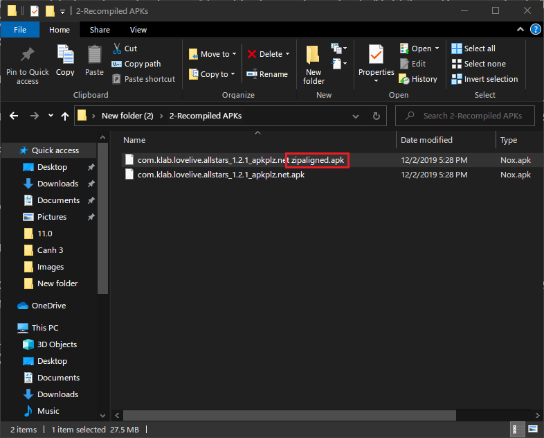
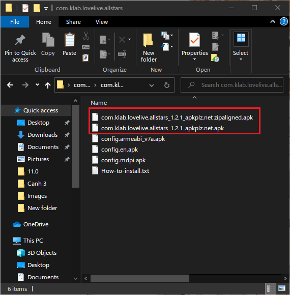
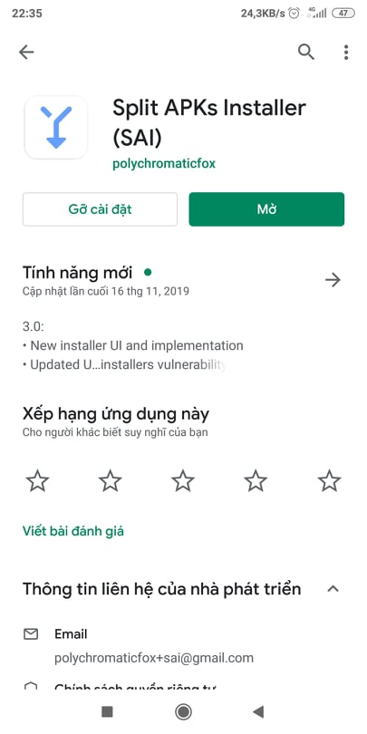
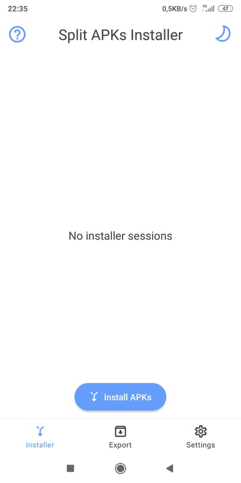
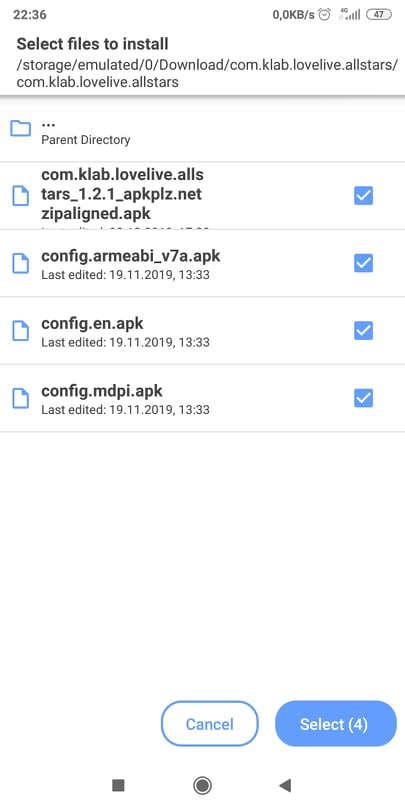

# An overview guide to playing LLAS on PC with Android-x86

## Note: This guide has not been finished writing.

## Installing Android-x86

Updating

## Make your own root-checker-less version of LLAS

To play LLAS with key-binding on Android-x86, root access is required. However, LLAS has a built-in root-checker that prevents you from entering the game if your device has root access enabled.
So firstly, we have to disable that root-checker.

***Note: You do not have to follow exactly what this guide tells you. From your own knowledge, you can follow the main idea of this guide and do it in another way, for example, with APK Editor***

### Tools
* Lastest Java and Java SE Development Kit.
* [APK Easy Tool (Download the lastest beta version).](https://forum.xda-developers.com/android/software-hacking/tool-apk-easy-tool-v1-02-windows-gui-t3333960)
* LLAS APKs bundle (You can get one on apkplz.net).

### Steps
#### Decompile the APK
1. Extract the LLAS APKs bundle to somewhere on your computer, as well as the APK Easy Tool (preferred as *AET* from now on).
2. Run AET (*apkeasytool.exe*), then drag-n-drop the main APK (the one with longest filename) of LLAS into AET.

3. Click on "Decompile". Wait until the decompiling process finishes.
The decompiled APK folder will be located in *\path_to_extracted_AET\1 - Decompiled APKs*.
You can click on *Decompiled APK Directory* under the *Decompile* button to open this directory.

#### Remove root-checking command
1. Navigate to *...\1 - Decompiles APKs\com.klab.lovelive.allstars_x.x.x_...\smali\com\klab\jackpot*
2. Open the file named *JackpotActivityCallback.smali* with your favourite text editor (Notepad++ is highly recommended).
3. Search for the following string: *if-eqz v0, :cond_2*
4. Replace it with: *goto :cond_2*

5. Save the file. You are done.

#### Recompiling the APK
1. Go back to AET. 
2. Under *Sign* section, tick *"ZipAlign after compile"* and *"Sign after compile"*

3. Click *Compile*. Wait until the process finishes.
The compiled APK will be located in *\path_to_extracted_AET\2 - Recompiled APKs*.
There will be 2 APKs. We just need the one with *"Zipaligned"* at the end of its filename. Delete the other one.

#### Installing the patched version of LLAS
1. Copy the remaining APK in the previous step to the directory where you extracted your LLAS bundle at the beginning.
2. Delete your original main APK file (Note: the new one is the one with *"zipaligned"* at the end of its filename).

3. Copy this folder to somewhere which is accessible from Android-x86. You can compress and upload it to Google Drive, then download and extract it again from Android-x86.
4. In Android-x86, install *Split APK Installer* from Play Store (I will use my Redmi 5 Plus to demonstrate this process).

5. Open Split APK Installer, tap on *Install APKs*.

6. Navigate to the folder where you placed all the APKs of LLAS. Select all of them, then tap *"Select"*

7. Wait for the installation to complete.
8. Enjoy. But we have not finished yet. We will have to do some key-mappings in order to play SIFAS with the best experience.

## Key-bindings

Updating
