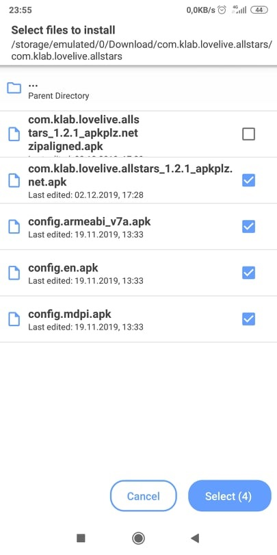

# An overview guide to playing LLAS on PC with Android-x86

This image is owned by KLab.

## NOTE: Deprecated, unfinished.
- From the February 2020 update, KLab now checks for the integrity of the SIFAS application everytime the game is started. This circumvention method is now useless.

## Section 1: Installing Android-x86

Updating (never).

## Section 2: Make your own rootcheckerless version of LLAS

**If you have a patched APK of LLAS working properly on rooted devices, or somehow you can make LLAS to work properly on Android-x86 without un-rooting, you can skip all steps in this section.**

To play LLAS with key-binding on Android-x86, root access is required. However, LLAS has a built-in root checker that prevents you from entering the game if your device is rooted.
So firstly, we have to disable that root checker.

***Note: You do not have to follow exactly what this guide tells you. From your own knowledge, you can follow the main idea of this guide and do it in another way, for example, by using APK Editor right on Android-x86.***

### 2.1. Tools
* Lastest Java and Java SE Development Kit.
* [APK Easy Tool (Download the lastest beta version).](https://forum.xda-developers.com/android/software-hacking/tool-apk-easy-tool-v1-02-windows-gui-t3333960)
* LLAS APKs bundle.
	* Grab another Android device. Open Qooapp, download LLAS, but do not install it yet. Navigate to `/sdcard/Android/data/com.qooapp.qoohelper/files/Download/` and grab all LLAS APK files. (safe, recommended)
	* You can also get one on apkplz.net (not safe, not recommended, but easier).

### 2.2. Steps
#### a. Decompile the APK
1. Extract the LLAS APKs bundle to somewhere on your computer, as well as the APK Easy Tool (preferred as *AET* from now on).
2. Run AET (`apkeasytool.exe`), then drag-n-drop the main APK (the one with longest filename) of LLAS into AET.

3. Click on `Decompile`. Wait until the decompiling progress finishes.
The decompiled APK folder will be located in `\path_to_extracted_AET\1 - Decompiled APKs`.
You can click on `Decompiled APK Directory` under the `Decompile` button to open this directory.

#### b. Remove root-checking command
1. Navigate to `...\1 - Decompiles APKs\com.klab.lovelive.allstars_x.x.x_...\smali\com\klab\jackpot`
2. Open the file named `JackpotActivityCallback.smali` with your favourite text editor.
3. Search for the following string: ***if-eqz v0, :cond_2***
4. Replace it with: ***goto :cond_2***

* **Advanced note**: The above root-checking code is written in Smali, which is a low-level programming language for Dalvik VM. It is highly identical to Assembly language. The overall idea of the mentioned piece of code is:
	* Invoke a method to check for the presence of su binary on your device and save the result to register `v0`.
	* If `v0 = 0` (which means your device is not rooted), the program will jump to `return-void` (labled by `:cond_2`. The game will be started normally.
	* Otherwise (your device has root access, register `v0 != 0`), it will jump to another label, preventing the game from being started.
	* We have just removed the conditional jump of the root-checking process. The game will always jump to `return-void` whether your device has root access or not. As a result, SIFAS from now on will always start normally.

5. Save the file. You are done.

#### c. Recompiling the APK
1. Go back to AET. 
2. Under the *Sign* section, tick `"ZipAlign after compile"` and `"Sign after compile"`

3. Click `Compile`. Wait until the process finishes.
The compiled APK will be located in `\path_to_extracted_AET\2 - Recompiled APKs`.
There will be 2 APKs. Only the one with `"Zipaligned"` at the end of its filename is needed. Just delete the other.

#### d. Install the original version of LLAS first

* **In Android-x86, install LLAS normally from Qooapp. If you are unable do so, follow all of the below steps.**

* ***If you can install LLAS normally from Qooapp, you can skip steps from 4 to 7. But it is highly recommended that you should read them as well to know which files we will need to work on.***

1. Copy the final APK in the previous step to the directory where you extracted your LLAS bundle from the beginning.

3. Copy this folder to somewhere accessible by Android-x86. You can compress and upload it to Google Drive, then download and extract it again from Android-x86.

***The below steps are advanced to some extent. You should not follow them unless you are familiar with browsing Android system files.***
***Note: Installing the patched APK directly with Split APK Installer won't work.***

4. In Android-x86, install *Split APK Installer* from Play Store (I will use my Redmi 5 Plus to demonstrate this process).
5. Open Split APK Installer, tap on *Install APKs*.

6. Navigate to the folder where you placed all LLAS APKs. Select the **original/old main APK**, then **other minor APKs**, but **NOT** the patched main APK. In other words, we are installing the **original version** of LLAS. Then tap *Select (4)* at the bottom corner of the screen.

7. Wait for the installation to complete.

#### e. Replace the original LLAS file with the patched one

1. Open a root explorer. Copy your **patched main APK** to `/data/app/com.klab.lovelive.allstars.../`.
2. In `/data/app/com.klab.lovelive.allstars.../`, delete `base.apk`. Rename your newly copied APK to `base.apk`. Chmod it `644`.
3. You are done. But we have not finished yet.

## Section 3: Key-bindings

Updating (never).
